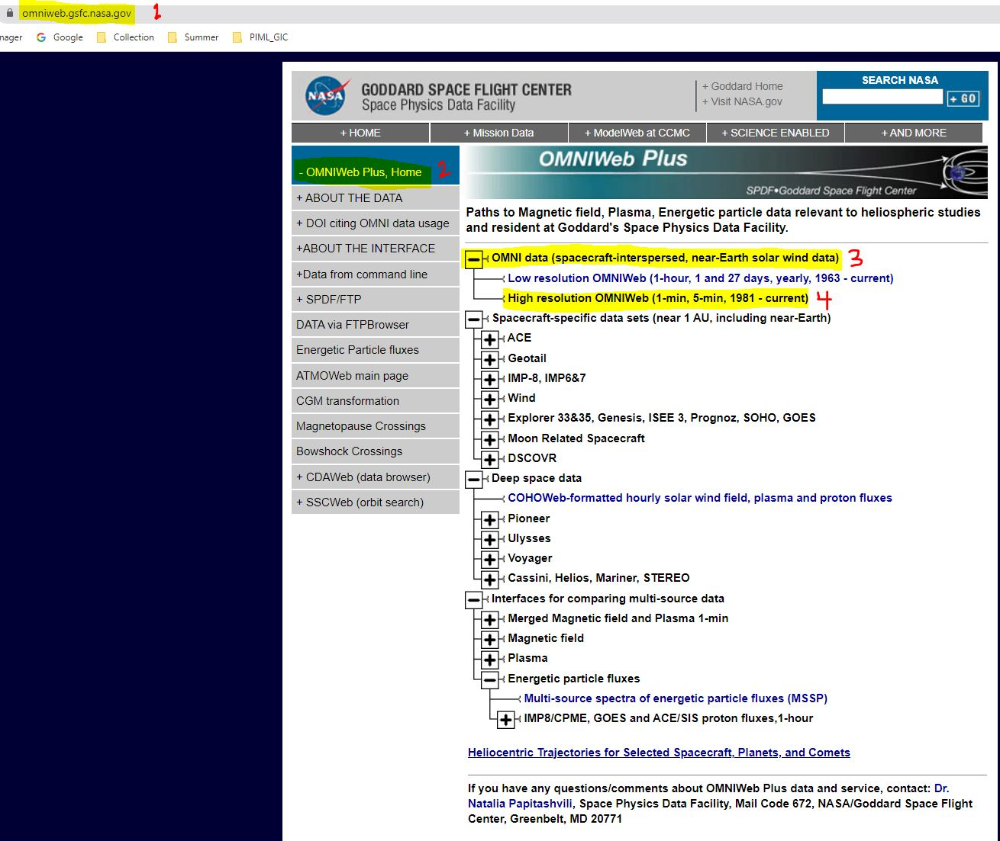
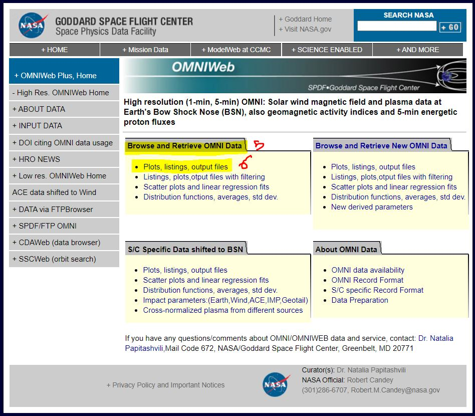
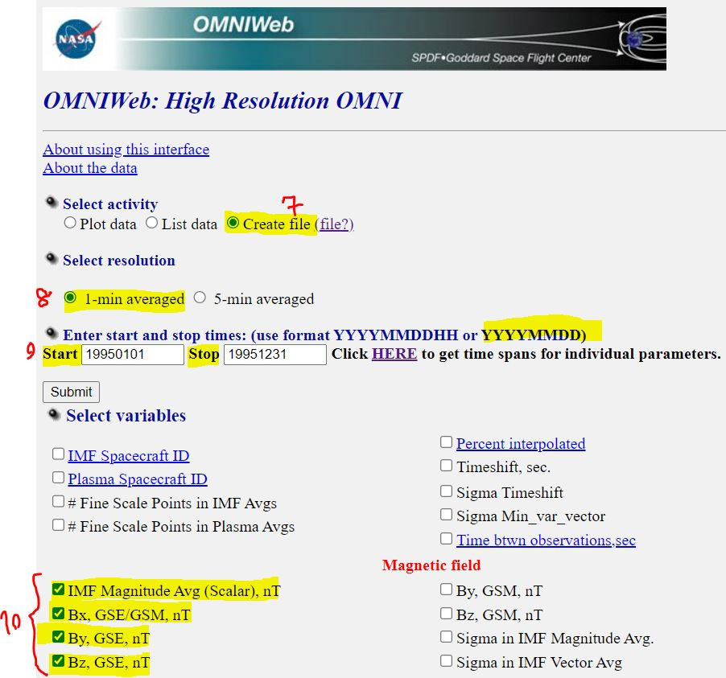
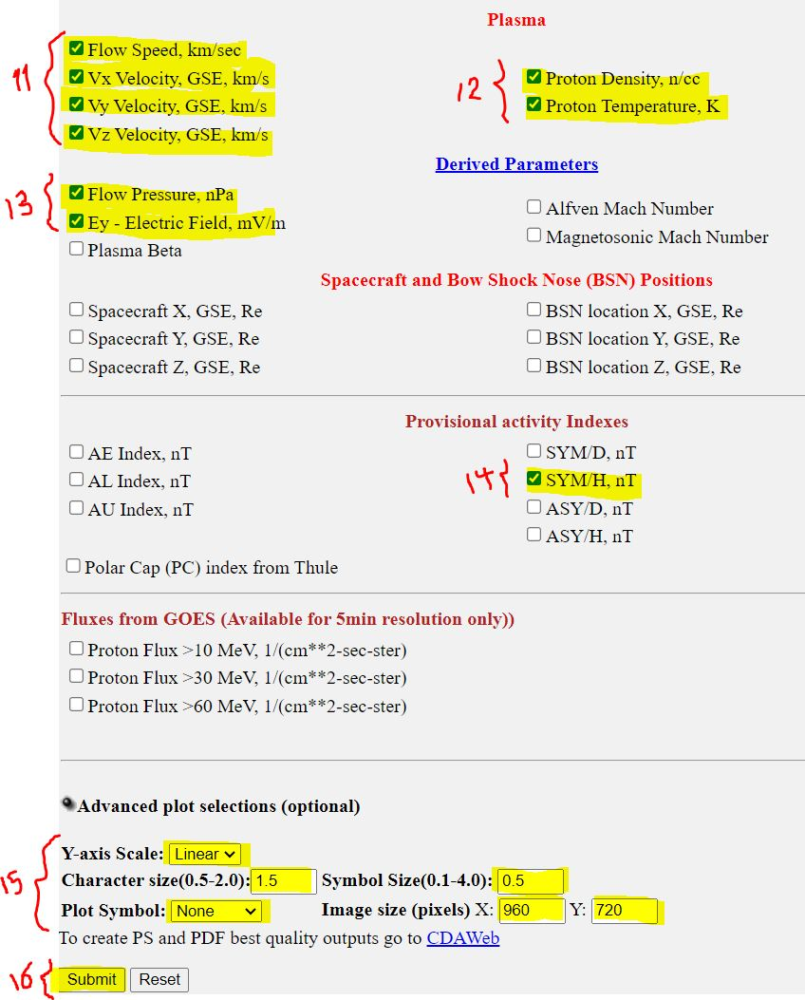
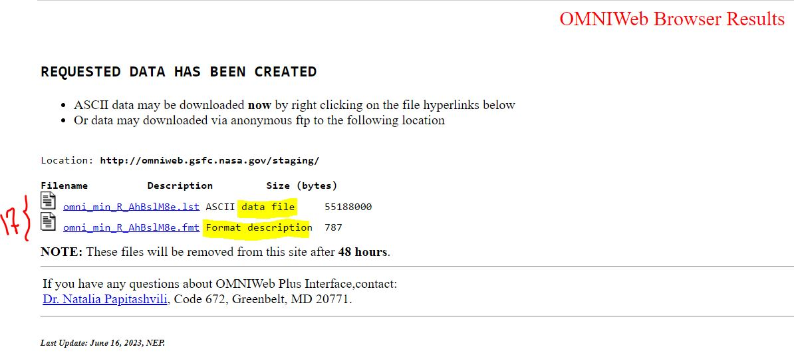
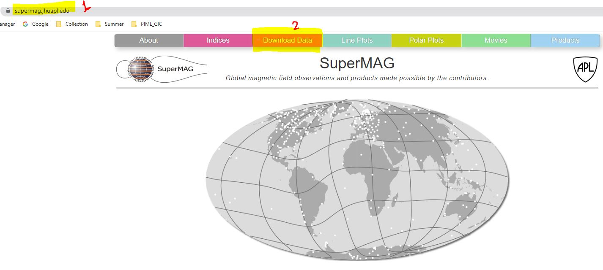
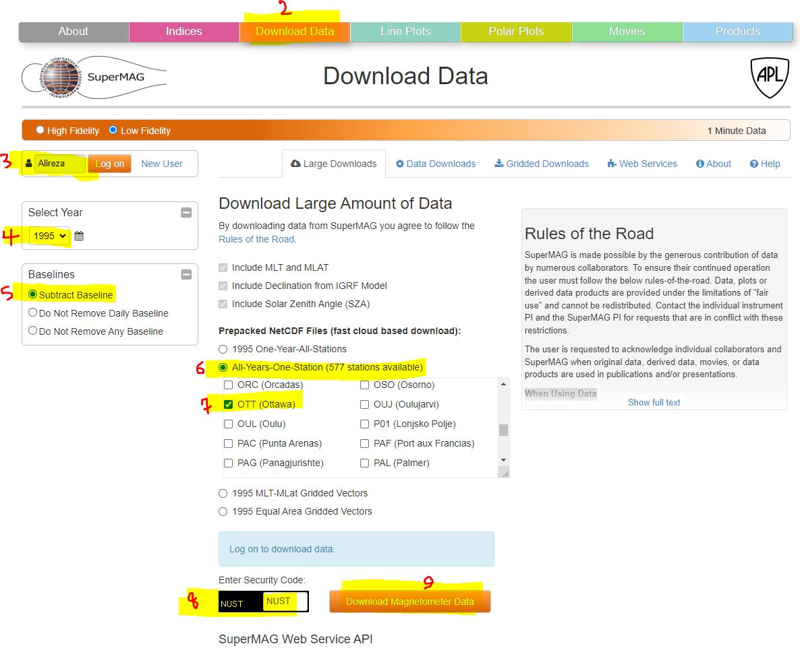

**Note**:
- Due to their large size, the datasets have not been uploaded to this repository. Below are links to our Google Drive, where you can download the datasets.
- Alternatively, using the following tutorial, you can download the data you need from the respective websites.

# Table of contents  

- [1. Links to our data](#1-links-to-our-data)  
- [2. Data acquisition method](#2-data-acquisition-method)  
    - [2.1. Solar wind data (OMNIWeb)](#21-solar-wind-data-omniweb)
    - [2.2. SuperMAG data](#22-supermag-data) 
- [3. Datasets descriptions](#3-datasets-descriptions) 
    - [3.1. Brief descriptions](#31-brief-descriptions)  
        - [3.1.1. Solar wind](#311-solar-wind)
    - [3.2. Full descriptions](#32-full-descriptions)

# 1. Links to our data
[merged_1995-2011_2015.parq.gzip](https://drive.google.com/file/d/1OCAKH5btTfZTNhzT-pii5RkgByprOFGL/view?usp=sharing)  
[solar_wind_1995-2022.parq.gzip](https://drive.google.com/file/d/1-FqPF_6B0JLsei25m3ciOhPpIhubj_uR/view?usp=sharing)  
[SuperMAG_1978-2021.parq.gzip](https://drive.google.com/file/d/1-LteRKPAIT0cmdRmkzyCM6ea1DJ3V3x5/view?usp=sharing)  

# 2. Data acquisition method

## 2.1. Solar wind data (OMNIWeb)

1. Open OMNIWeb Link (https://omniweb.gsfc.nasa.gov/)
2. Follow the instructions below

    
   
   
   
    

## 2.2. SuperMAG data

1. Open OMNIWeb Link (https://supermag.jhuapl.edu/)
2. Follow the instructions below

    
    

# 3. Datasets descriptions 

## 3.1. Brief descriptions

### 3.1.1. Solar wind 
Here is a description for each column in your "Solar wind Omniweb" dataset:  
- **year**: The year in which the observation was made.
- **day**: The day of the year when the observation was made, typically ranging from 1 to 365 (or 366 in leap years).
- **hour**: The hour of the day (in a 24-hour format) when the observation was made.
- **minute**: The minute of the hour when the observation was made.
- **field_magnitude_average**: This is the average magnitude of the Interplanetary Magnetic Field (IMF) over the given period. The IMF is carried by solar wind and extends from the sun.
- **Bx, By, Bz**: These are components of the IMF in the Geocentric Solar Magnetospheric (GSM) coordinate system. Bx is the Earth-Sun direction component, By is perpendicular to the Earth-Sun line within the ecliptic plane, and Bz is perpendicular to the ecliptic plane (northward).
speed: The speed of the solar wind, usually measured in kilometers per second.
- **Vx, Vy, Vz**: These are the components of the solar wind velocity in the GSM coordinate system.
- **proton_density**: The density of protons in the solar wind, typically measured in protons per cubic centimeter.
- **proton_temperature**: The temperature of the solar wind protons, usually measured in Kelvin.
- **flow_pressure**: The dynamic pressure of the solar wind, typically measured in nanoPascals. It depends on the solar wind's density and speed.
electric_field: This likely refers to the electric field in the solar wind, typically influenced by the solar wind speed and the IMF.
- **SYM/H**: A geomagnetic index that measures the symmetric part of the disturbance magnetic field in the horizontal plane at the Earth's surface. It can help in identifying and measuring the intensity of geomagnetic storms.

### 3.1.2 SuperMAG
Here is a description of each of the column names in SuperMAG dataset:
- **date_time**: The timestamp for each observation. This could be in various formats, but often it's in UTC (Coordinated Universal Time).  
- **dbe_geo**: The eastward component of the magnetic field variation (delta B) in geographic coordinates. It's typically measured in nano-Tesla (nT). 
- **dbe_nez**: The eastward component of the magnetic field variation (delta B) in North-East-Down (NED) or North-East-Z (NEZ) coordinates. 
- **dbn_geo**: The northward component of the magnetic field variation (delta B) in geographic coordinates.  
- **dbn_nez**: The northward component of the magnetic field variation (delta B) in NEZ coordinates.  
- **dbz_geo**: The downward (or vertical) component of the magnetic field variation (delta B) in geographic coordinates.  
- **dbz_nez**: The downward (or vertical) component of the magnetic field variation (delta B) in NEZ coordinates.  
- **decl**: The magnetic declination at the magnetometer station, i.e., the angle between geographic north (true north) and magnetic north.  
- **mcolat**: Magnetic co-latitude of the magnetometer station. This is 90 degrees minus the magnetic latitude, so it measures the angle from the magnetic north pole.  
- **mlat**: Magnetic latitude of the magnetometer station.  
- **mlon**: Magnetic longitude of the magnetometer station.  
- **mlt**: Magnetic Local Time at the magnetometer station. This is a measure of solar time based on the location's magnetic longitude.  
- **sza**: Solar Zenith Angle. This is the angle between the line perpendicular to the Earth's surface at a given location and the line from that location to the Sun. It's an indicator of the Sun's position in the sky and can be used to infer the level of solar radiation reaching the location.

## 3.2. Full descriptions
The full description is available on `GIC/4. Concepts _ Books _ Papers/README.md`.
