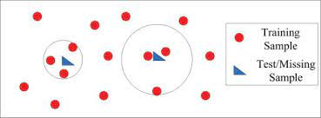

Geomagnetic Induced Currents (GIC)
=====

**Alireza Motazedian**

**Disclaimer**: This file contains a web search for personal use. In case of using the materials in our works, we need to take care of plagiarism issues first. 

## Table of contents

- [0. Jargon](#0-jargon)  
- [1. Introduction](#1-introduction)  
    - [1.1. Solar wind: What is it and how does it affect Earth?](#11-solar-wind-what-is-it-and-how-does-it-affect-earth)	
    - [1.2. Geomagnetic Induced Currents (GIC)](#12-geomagnetic-induced-currents-gic)	
    - [1.3. Concept of UT](#13-concept-of-ut)	
- [2. Website](#2-website)	
    - [2.1. SuperMAG](#21-supermag)	
        - [2.1.1 SuperMAG definition](#211-supermag-definition)	
        - [2.1.2. Subtract Baseline](#212-subtract-baseline)	
        - [2.1.3. High Fidelity and Low Fidelity](#213-high-fidelity-and-low-fidelity)	
    - [2.2. Solar wind](#22-solar-wind)	
- [3. Datasets descriptions](#3-datasets-descriptions)	
    - [3.1. Solar wind (description)](#31-solar-wind-description)	
    - [3.2. SuperMAG (description)](#32-supermag-description)	
- [4. Machine Learning](#4-machine-learning)	
    - [4.1. Time Series Analysis](#41-time-series-analysis)	
    - [4.2. Kriging Techniques](#42-kriging-techniques)	
    - [4.3. ADAM](#43-adam)	
    - [4.4. Filling missing values](#44-filling-missing-values)
        - [4.4.1. Mean](#441-mean)    
        - [4.4.2. Median](#442-median)  
        - [4.4.3. Mode](#443-mode)  
        - [4.4.4. Constant number or string](#444-constant-number-or-string)  
        - [4.4.5. Miss Forest](#445-miss-forest)  
        - [4.4.6. Mice Forest](#446-mice-forest)  
        - [4.4.7. KNN Imputation](#447-knn-imputation)          
- [5. Papers](#5-papers)	
    - [5.1. PILM: A Survey on Problems, Methods and Applications](#51-pilm-a-survey-on-problems-methods-and-applications)	
    - [5.2. a real-time GMD monitoring system](#52-a-real-time-gmd-monitoring-system)	

# 0. Jargon
01. **PIML**: Physics-Informed Machine Learning 
02. **PINN**: Physics-Informed Neutral Network
03. **GIC**: Geomagnetic Induced Current
03. **PDE**: Partial Differential Equation
04. **ODE**: Ordinary Differential Equation
05. **SDE**: Stochastic Differential Equation
06. **GCN**: Graph Convolutional Network
07. **FDM**: Finite Difference Method 
08. **FVM**: Finite Volume Method
09. **SGD**: Stochastic Gradient Descent
10. **CNN**: Convolutional Neural Network
11. **NSF**: National Science Foundation
12. **RNN**: Recurrent Neural Networks 
13. **GRU**: Gated Recurrent Unit 
14. **MLP**: Multi-Layer Perceptron
15. **NTK**: Neural Tangeting Kernel 
16. **TFC**: Theory of Functional Connections
17. **HNN**: Hamiltonian Neural Networks
18. **VAE**: Variational Auto-Encoders
19. **GMD**: Geomagnetic Disturbances
20. **CME**: Coronal Mass Ejection
21. **GDV**: Geographic Data View
22. **POD**: Proper Orthogonal Decomposition
23. **FNO**: Fourier Neural Operator 
24. **FFT**: Fast Fourier Transformation
25. **GEM**: Geospace Environment Modeling
26. **MSE**: Mean Square Error
27. **SWPC**: Space Weather Prediction Center 
28. **NOAA**: National Oceanic and Atmospheric Administration 
29. **DASI**: Distributed Arrays of Small Instruments
30. **PGMD**: Pseudo-Geographic Mosaic Display
31. **RELU**: REctified Linear Unit
32. **RMSE**: Root Mean Square Error
33. **LSTM**: Long-Short Term Memory network 
34. **ADAM**: Adaptive Moment Estimation
35. **IAGA**: International Association of Geomagnetism and Aeronomy 

# 1. Introduction

## 1.1. Solar wind: What is it and how does it affect Earth?
 
Solar wind is a stream of charged particles, mainly protons and electrons, flowing from the Sun into space. It is a continuous flow of high-speed particles that carries the Sun's magnetic field throughout the solar system. The solar wind is created by the Sun's hot outer atmosphere, known as the corona, which has temperatures reaching millions of degrees Celsius. The solar wind affects Earth in several ways:

1.	**Aurora Formation**: The solar wind plays a crucial role in the formation of auroras, also known as the northern lights (aurora borealis) in the Northern Hemisphere and the southern lights (aurora australis) in the Southern Hemisphere. When solar wind particles interact with Earth's magnetosphere, they create a beautiful display of colorful lights in the polar regions.

2.	**Magnetic Field Interaction**: The solar wind carries the Sun's magnetic field, which interacts with Earth's magnetosphere. This interaction can cause various effects, including geomagnetic storms and disturbances in Earth's magnetic field. Geomagnetic storms can lead to disruptions in satellite communications, power grids, and navigation systems.

3.	**Space Weather**: The solar wind and its variations contribute to space weather, which refers to the dynamic conditions in the space environment surrounding Earth. Space weather can impact satellite operations, spacecraft trajectories, and astronaut safety during spacewalks or extended missions in space. Understanding and predicting solar wind behavior is crucial for space weather forecasting and protecting space-based assets.

4.	**Radiation Hazard**: The solar wind carries energetic particles that can pose a radiation hazard to astronauts and satellites in space. Exposure to high-energy particles from the solar wind can damage DNA and increase the risk of cancer and other health effects in humans. It is necessary to consider radiation protection measures for space missions beyond Earth's protective magnetosphere.

In summary, the solar wind, as a continuous flow of charged particles from the Sun, affects Earth's magnetic field, causes aurora formations, contributes to space weather phenomena, and presents radiation hazards for space activities. Understanding the behavior of the solar wind is essential for studying and mitigating its impacts on Earth and space-based systems.

  
*ّFigure_01*  

## 1.2. Geomagnetic Induced Currents (GIC)

Geomagnetic Induced Currents (GICs) are created as a result of the interaction between the Earth's magnetic field and varying external magnetic fields caused by geomagnetic disturbances, particularly during geomagnetic storms. The process by which GICs are created can be explained as follows:

1.	**Solar Activity**: Geomagnetic storms and GICs are primarily driven by solar activity. The Sun constantly emits a stream of charged particles called the solar wind. Occasionally, solar eruptions like coronal mass ejections (CMEs) occur, which release a large amount of plasma and magnetic fields into space.

2.	**Interaction with the Earth**: When the solar wind and its embedded magnetic fields reach the Earth, they interact with the Earth's magnetic field, which surrounds our planet and extends into space. The Earth's magnetic field is generated by the motion of molten iron within the planet's core.

3.	**Magnetic Field Disturbances**: The interaction between the solar wind and the Earth's magnetic field can cause variations in the Earth's magnetic field. These variations are typically stronger during geomagnetic storms triggered by intense solar activity.

4.	**Induced Electric Fields**: The changing magnetic field induces electric fields in the Earth's conductive crust and near-surface materials. This occurs due to Faraday's law of electromagnetic induction, which states that a changing magnetic field induces an electric field in a conductor.

5.	**Conductive Materials**: The induced electric fields drive electric currents through conductive materials on or near the Earth's surface. Common conductive materials include power transmission lines, pipelines, and other long metallic structures.

6.	**Path of Least Resistance**: The induced currents flow through the path of least resistance, following conductive paths such as power grids and pipelines. These currents can circulate through extensive networks, potentially affecting multiple regions.

The magnitude of GICs depends on various factors, including the intensity and duration of the geomagnetic disturbance, the characteristics of the Earth's magnetic field at the location, the conductivity of the materials, and the configuration of the infrastructure.

Monitoring and predicting geomagnetic disturbances are essential for assessing the potential risk of GICs and implementing measures to mitigate their effects on critical infrastructure.

## 1.3. Concept of UT
The magnetometer operates on Coordinated Universal Time (UT) and has a lag of 5 hours. 
This means that local midnight in Ottawa occurs at 05:00 UT. The lag is important because it helps align the magnetometer readings with specific time references and allows for consistent analysis and comparison of the data.

# 2. Website 

## 2.1. SuperMAG

### 2.1.1 SuperMAG definition
SuperMAG is a worldwide collaboration of organizations and agencies that provide ground-based magnetometer measurements. These instruments are used to monitor variations in Earth's magnetic field, providing valuable data for understanding various geomagnetic phenomena like auroras, solar storms, and the interaction between solar wind and Earth's magnetosphere.

### 2.1.2. Subtract Baseline
In the context of SuperMAG data, "Subtract Baseline" could refer to the process of removing the baseline or background magnetic field level from the observed data. This helps to isolate the variations or fluctuations in the magnetic field that are of interest.

In other words, the 'baseline' represents the average or normal state of the magnetic field, and by subtracting this from the actual measurements, scientists can better see and analyze the deviations or anomalies in the field. This could be particularly important for identifying and studying events like magnetic storms or substorms.
In short, "Subtract Baseline" is a data preprocessing step that helps isolate the signal of interest (in this case, magnetic variations) from the overall data.

### 2.1.3. High Fidelity and Low Fidelity
The terms "High Fidelity" and "Low Fidelity" in the context of data typically refer to the level of detail, accuracy, and quality of the data.

High Fidelity data is generally more accurate and has more detailed information. It often comes from higher quality or more precise instruments and measurements. It has a higher resolution, meaning it has more data points over a given interval, which can give a more detailed picture of changes over time.

Low Fidelity data, on the other hand, is generally less detailed and may be less accurate. It has a lower resolution, meaning it has fewer data points over the same interval. This might mean that some detail is lost, but it can also make the data easier to handle and process, particularly in large quantities or over large timescales.

SuperMAG service includes data with two different temporal resolutions, 1-min, and 1-sec. The latter is a subset of the former as not all stations provide 1-sec data. 
The 1-min data and all derived products can be accessed by selecting the 'Low Fidelity' option under Indices, Data, Polar Plots, Movies, and Products. 
The 1-sec data and all derived products can be accessed by selecting the 'High Fidelity' option under Data and Polar Plots.

## 2.2. Solar wind

# 3. Datasets descriptions 

## 3.1. Solar wind (description)
Here is a description for each column in "Solar wind Omniweb" dataset:

⮚	**year**: The year in which the observation was made.

⮚	**day**: The day of the year when the observation was made, typically ranging from 1 to 365 (or 366 in leap years).

⮚	**hour**: The hour of the day (in a 24-hour format) when the observation was made.

⮚	**minute**: The minute of the hour when the observation was made.

⮚	**Field magnitude average**: This is the average magnitude of the Interplanetary Magnetic Field (IMF) over the given period. 
The Interplanetary Magnetic Field (IMF) is a crucial aspect of our solar system, extending from the Sun into interplanetary space. It's carried out into space by the solar wind, a stream of charged particles emitted from the Sun's upper atmosphere. The IMF varies and has complex structures based on the Sun's rotation and solar activities like solar flares and sunspots.
According to the University of Maryland's Space Weather Prediction Center, the IMF value typically ranges from about 1 to 20 nanoTesla (nT). 

Two main types of IMF exist:  
✔	**The Parker Spiral**: This type of IMF is named after solar astrophysicist Eugene Parker. It is a spiral-shaped magnetic field resulting from the rotation of the Sun. The Sun rotates faster at its equator than at its poles, causing the magnetic field lines to take on a spiral shape, much like the water from a spinning garden hose.  

  
*Figure_02*  

  
*Figure_03*  

   
*Figure_04* 

✔	**The Interplanetary Shock**: This is a rapid change in the IMF caused by a significant solar event like a coronal mass ejection (CME). A CME is a massive burst of solar wind and magnetic fields rising above the solar corona or being released into space. These shocks can travel through space and affect planets' magnetic fields, including Earth's.

  
*Figure_05: Interplanetary shock wave S f developed in the solar wind as a result of a chromospheric flare or a coronal mass ejection on the Sun S, and force lines of the interplanetary magnetic field B sw. Spacecraft are schematically shown in the neighborhood of the Lagrange point L 1 and the Earth's bow shock S b and in the magnetosheath between S b and the magnetopause m which is the boundary of the magnetosphere M (shown in section with an image of the Earth's magnetic field); broken curve corresponds to the Earth's (E) orbit.*

The "field magnitude average" metric is a measure of the IMF's average strength over a specific period. It incorporates the average of the IMF's three components: the north-south component, the east-west component, and the radial component (the component that points towards or away from the Sun). 

The IMF and its influence are not static but subject to change based on solar activity. Therefore, scientists employ various tools and techniques, including satellite observations and mathematical models, to track and forecast changes in the IMF. Understanding these changes is pivotal for our comprehension of the Sun-Earth connection, which can influence space weather and potentially disrupt technologies that our society heavily relies upon.

Here are some additional details about the field magnitude average metric:  
●	The units of the field magnitude average metric are nanotesla (nT).  
●	The average IMF strength is about 5nT.  
●	The strongest IMF storms can have field strengths of up to 100nT.  
●	The field magnitude average metric is typically calculated over a period of days or weeks.

The term "heliosphere" is used to denote the vast bubble-like region surrounding the Sun, dominated by the solar wind and its associated IMF. This region acts as a protective shield for the planets within our solar system against cosmic radiation. When we refer to the IMF as the "Heliospheric Magnetic Field," we emphasize its role and reach throughout the heliosphere.

  
*Figure_06*  

  
*Figure_07*  

⮚	**Bx**, **By**, **Bz**: These are components of the IMF in the Geocentric Solar Magnetospheric (GSM) coordinate system. 
These components of the IMF typically vary between about -10 and +10 nT. This information is based on the GSM coordinate system used in space weather studies. 
  
*Figure_08*

The geocentric coordinate system is not a planar coordinate system based on a map projection. It is a geographic coordinate system in which the earth is modeled as a sphere or spheroid in a right-handed XYZ (3D Cartesian) system measured from the center of the earth.

●	**Bx**: This component represents the IMF along the Earth-Sun direction. It indicates the strength and direction of the magnetic field aligned with the line connecting the Earth and the Sun. It can be thought of as the "north-south" component of the IMF.

●	**By**: This component represents the IMF perpendicular to the Earth-Sun line but within the ecliptic plane. The ecliptic plane is the plane defined by the Earth's orbit around the Sun. By indicates the strength and direction of the magnetic field in the east-west direction within this plane.

●	**Bz**: This component represents the IMF perpendicular to the ecliptic plane. It indicates the strength and direction of the magnetic field pointing either northward or southward. A positive Bz value indicates a northward-directed magnetic field, while a negative Bz value indicates a southward-directed magnetic field.

  
*Figure_09*

⮚	**Speed**: The speed of the solar wind, usually measured in kilometers per second.

●	The speed of the solar wind is usually measured in kilometers per second (km/s).  
●	The speed of the solar wind is influenced by the Sun's magnetic field, the solar activity, and the distance from the Sun.      
●	CMEs can cause the speed of the solar wind to increase significantly.
●	According to NASA, solar wind speeds typically range between 250 and 800 kilometers per second (km/s), but can occasionally exceed 1000 km/s during strong solar storms.

⮚	**Vx**, **Vy**, **Vz**: These are the components of the solar wind velocity in the GSM coordinate system.
●	**Vx**: This component represents the velocity of the solar wind in the direction from the Earth towards the Sun. This is along the X-axis of the GSM system. A negative Vx value would typically indicate solar wind moving from the Sun towards the Earth.

●	**Vy**: This component represents the velocity of the solar wind in the direction perpendicular to the Earth-Sun line, within the plane of the Earth's orbit around the Sun (the ecliptic plane). This is along the Y-axis of the GSM system.

●	**Vz**: This component represents the velocity of the solar wind in the direction perpendicular to the ecliptic plane, essentially northward or southward relative to the Earth-Sun line. This is along the Z-axis of the GSM system.

⮚	**Proton density**: The density of protons in the solar wind.

●	The proton density of the solar wind is usually measured in protons per cubic centimeter (p/cc).    
●	The proton density is influenced by the Sun's magnetic field, the solar activity, and the distance from the Sun.  
●	CMEs can cause the proton density of the solar wind to increase significantly.  
●	The proton density in the solar wind typically falls between 1 and 10 protons per cubic centimeter. This information is referenced from the University of Maryland's Space Weather Prediction Center.

⮚	**Proton temperature**: The temperature of the solar wind protons.

●	The proton temperature of the solar wind is usually measured in Kelvin (K).   
●	The proton temperature is influenced by the Sun's magnetic field, the solar activity, and the distance from the Sun.  
●	CMEs can cause the proton temperature of the solar wind to increase significantly.  
●	The temperature of solar wind protons can vary quite a bit, but it's typically between 10,000 and 2,000,000 degrees Kelvin according to NASA's studies on solar wind. 

⮚	**Flow pressure**: The dynamic pressure of the solar wind.

●	The flow pressure of the solar wind is usually measured in nanopascals (nPa).  
●	The flow pressure is influenced by the density and speed of the solar wind.  
●	CMEs can cause the flow pressure of the solar wind to increase significantly.  
●	The dynamic pressure of the solar wind can be in the range of 1 to 10 nPa. This can be referenced from a paper by Richardson and Cane in the Journal of Geophysical Research.  

⮚	**Electric field**: 
The solar wind's electric field is a critical parameter in understanding space weather and geomagnetic activities. It arises due to the motion of the charged particles in the solar wind across the Interplanetary Magnetic Field (IMF). This motion of charged particles creates an electric field, which is perpendicular to both the solar wind velocity and the IMF direction. Visualize the solar wind velocity vector (V) and the IMF vector (B) within this 3D space. The electric field vector (E) will be perpendicular to both V and B. In reality, these vectors may not align perfectly with the axes of the GSM system, but it's important to understand that E, V, and B are mutually perpendicular in the frame of the solar wind.

●	The electric field in the solar wind is usually measured in volts per meter (V/m).      
●	The electric field is influenced by the solar wind speed and the IMF.  
●	CMEs can cause the electric field in the solar wind to increase significantly.  
●	This could range quite broadly depending on solar wind speed and IMF, typically between 0 and 10 mV/m according to space weather prediction models.

  
*Figure_10*  

  
*Figure_11*  

  
*Figure_12*  

⮚	**SYM/H**:

The SYM/H index is a very important tool in the study of geomagnetism and space weather, specifically for monitoring and studying geomagnetic storms. This index is derived from magnetic field measurements taken at several locations around the Earth, and it provides a measure of the changes in the Earth's magnetic field in response to solar activity.

Here's how it works:
Geomagnetic storms are global disturbances in the Earth's magnetic field caused by changes in the solar wind. These disturbances can cause the Earth's magnetic field to fluctuate, and the SYM/H index is designed to measure these fluctuations.

✔	**Symmetric part of the disturbance**: When a geomagnetic storm occurs, it causes disturbances in the Earth's magnetic field that can be roughly divided into two parts: a symmetric part and an asymmetric part. The symmetric part represents the average global effect of the storm, while the asymmetric part represents localized effects. The SYM/H index specifically measures the symmetric part of the disturbance in the horizontal plane at the Earth's surface.

✔	**Measurement in the horizontal plane**: The SYM/H index focuses on changes in the horizontal component of the Earth's magnetic field. This is important because it's the horizontal component that primarily interacts with the Earth's surface and atmosphere, causing the effects we associate with geomagnetic storms.

✔	**Monitoring and studying geomagnetic storms**: The SYM/H index provides a way to quantify the intensity of a geomagnetic storm. By tracking changes in the SYM/H index, researchers can monitor the progress of a storm, measure its peak intensity, and study its effects. A larger change in the SYM/H index corresponds to a stronger storm.

●	The SYM/H index is usually measured in nanotesla (nT).  
●	The SYM/H index is a measure of the symmetric part of the disturbance magnetic field in the horizontal plane at the Earth's surface.  
●	The disturbance magnetic field is the magnetic field that is caused by the interaction of the solar wind with the Earth's magnetic field.  
●	Geomagnetic storms are caused by large solar storms, such as coronal mass ejections (CMEs).  
●	The SYM/H index is a useful tool for space weather forecasting.  
●	This index can range from around -500 to +500 nanoTesla during strong geomagnetic storms as per NOAA's space weather scale for geomagnetic storms

## 3.2. SuperMAG (description)
Here is a description for each column in "SuperMAG" dataset:

⮚ **Date_UTC**:"Date_UTC" in the SuperMAG dataset represents each observation's timestamp, standardized to Coordinated Universal Time (UTC), an international time standard. Regardless of the geographical location or local time of data collection, using UTC ensures accurate comparison and correlation of global data.

The timestamp typically includes year, month, day, hour, minute, and possibly second of the observation in a format like "YYYY-MM-DD HH:MM:SS". An example could be "2023-07-05 14:30:00", indicating a measurement made at 2:30 pm on July 5, 2023, in UTC time.

The presence of a UTC timestamp is critical for time series analysis, tracking temporal changes, and correlating events across various datasets or locations.

⮚ **IAGA**: The International Association of Geomagnetism and Aeronomy (IAGA) promotes the study of geomagnetism and aeronomy, key fields for understanding Earth's magnetic field and its interactions with solar and cosmic radiation.

In a SuperMAG dataset, an IAGA code is a unique identifier for each magnetometer station across the globe. These stations, equipped with magnetometers, measure the strength and direction of the magnetic field at specific locations.

Each station's unique IAGA code (typically a three-letter code) helps identify its contributed data, pinpoint the station's location, and facilitate cross-referencing with other databases. This aids in understanding global geomagnetic phenomena, like geomagnetic storms, which can have varying impacts at different Earth locations.

⮚ **GEOLON (Geographic Longitude)**: The Geographic Longitude, also known as GEOLON in data sets, represents the east-west position of a point on the Earth's surface. It's the angular distance east or west of the Prime Meridian, a line of longitude at 0 degrees that runs through Greenwich, London.

Longitude is measured in degrees, ranging from -180 (180 degrees west) to +180 (180 degrees east). The Prime Meridian (0 degrees longitude) serves as the reference point for these measurements.

In the context of the SuperMAG dataset, the GEOLON value would refer to the longitude of the location of each magnetometer station. This gives the east-west position of the station on the Earth's surface.

For example, a magnetometer station in New York would have a GEOLON value around -74 (since New York is approximately 74 degrees west of the Prime Meridian), while a station in Tokyo would have a GEOLON value around +140 (since Tokyo is approximately 140 degrees east of the Prime Meridian).

Knowing the longitude of the magnetometer station is crucial for a variety of geophysical analyses. It helps in correlating the geomagnetic data with its geographic location, which is essential when examining global phenomena like geomagnetic storms and their effects on different parts of the world.

  
*Figure_13*: Longitude lines are drawn between the North Pole and the South Pole. (A) The prime meridian (0°) divides earth into two halves of 180°. (B) Longitude is measured in degrees from 0° to 180° east or west of the prime meridian. | 

  
*Figure_14*: (A) East and west longitude meeting at 180˚ meridian. (B) The 180˚ meridian is on the opposite side of the globe from the prime meridian.

⮚ **GEOLAT (Geographic Latitude)**: Geographic Latitude, or GEOLAT in many datasets, represents the north-south position of a point on the Earth's surface. It's the angular distance from the equator to that point, north or south.

Latitude is measured in degrees, with the equator representing 0 degrees, the North Pole +90 degrees, and the South Pole -90 degrees.

In the context of the SuperMAG dataset, the GEOLAT value refers to the latitude of each magnetometer station's location. This provides the north-south position of the station on the Earth's surface.

For instance, a magnetometer station in Sydney, Australia would have a GEOLAT value of approximately -34 (as Sydney is about 34 degrees south of the equator), while a station in Oslo, Norway would have a GEOLAT value of around +60 (as Oslo is about 60 degrees north of the equator).

  
*Figure_15*

  
*Figure_16*

⮚ **MAGON (Magnetic Longitude)**: The magnetic longitude, also known as MAGLON in many datasets, is similar to geographic longitude, but it's based on the Earth's magnetic field rather than the surface geography. It refers to the east-west position of a point relative to the Earth's magnetic field.

The geomagnetic coordinates are based on a geomagnetic model (like the International Geomagnetic Reference Field, IGRF) which represents the Earth's magnetic field. In this model, the "prime meridian" is not the geographic prime meridian that goes through Greenwich, but the meridian that goes through the magnetic north pole.

The magnetic north pole does not align perfectly with the geographic North Pole, and it even moves over time (a phenomenon called secular variation). So, a magnetometer's magnetic longitude can be quite different from its geographic longitude.  
Magnetic longitude ranges from 0 to 360 degrees. The same reference can be used.

  
*Figure_17*

⮚ **MAGLAT (Magnetic Latitude)**: This is the latitude of the magnetometer station in geomagnetic coordinates.

Magnetic Latitude, often abbreviated as MAGLAT in datasets, is similar to geographic latitude, but it's based on the Earth's magnetic field rather than the Earth's surface geography.

Geographic latitude denotes the north-south position of a point on the Earth's surface, measured as an angle from the equator (0 degrees) to the North (+90 degrees) or South (-90 degrees) poles.

In contrast, Magnetic Latitude refers to the north-south position of a point relative to the Earth's magnetic field. In this coordinate system, 0 degrees refers to the magnetic equator (the line around the Earth halfway between the magnetic north and south poles), +90 degrees refers to the magnetic North Pole, and -90 degrees refers to the magnetic South Pole.

The Earth's magnetic poles do not perfectly align with the geographic poles, and they even move over time due to changes in the Earth's core (a phenomenon known as geomagnetic secular variation). Therefore, a location's magnetic latitude can be different from its geographic latitude.  
Magnetic latitude also ranges from -90 degrees at the magnetic south pole to +90 degrees at the magnetic north pole. The same reference can be used. 

  
*Figure_18*  

⮚ **MLT (Magnetic Local Time)**: Magnetic Local Time (MLT) is a measure of time based on the position of a location with respect to the Sun, but with reference to the Earth's magnetic field rather than its geographical features. In essence, it's solar time, but tied to magnetic, not geographic, coordinates.

Just like geographic local time, where noon is defined as when the Sun is at its highest point in the sky, in Magnetic Local Time, magnetic noon is when the Sun is in line with the magnetic meridian of the location. This is the line running from magnetic north to magnetic south through that point.

Because the Earth's magnetic field is not perfectly aligned with its rotation axis, and because the magnetic poles wander over time, the MLT for a given location will not usually match the geographic local time. It's also worth noting that MLT varies as the Earth rotates, just like geographical local time.

The concept of MLT is particularly important in the field of space weather and geomagnetism, because many phenomena related to the Earth's magnetic field and its interaction with the solar wind have a strong dependence on MLT. For example, the occurrence and strength of auroras and geomagnetic disturbances can vary significantly with MLT. In the context of the SuperMAG dataset, the MLT would be the local time at each magnetometer station, in terms of magnetic coordinates.  
Magnetic Local Time ranges from 0 to 24 hours, like conventional time.

⮚ **MCOLAT (Magnetic Co-latitude)**: Magnetic Co-latitude, often referred to as MCOLAT in various datasets, is a way of defining a location's position with respect to the Earth's magnetic field. More specifically, it is calculated as 90 degrees minus the magnetic latitude of a given point.

While magnetic latitude measures the angle between the location and the magnetic equator (ranging from -90 degrees at the magnetic South Pole to +90 degrees at the magnetic North Pole), magnetic co-latitude is the complementary angle measuring from the magnetic North Pole.

This means that the magnetic co-latitude of a point is the angle from that point to the magnetic North Pole along a line of longitude, with the magnetic North Pole itself being at 0 degrees, and the magnetic equator being at 90 degrees.

This way of measuring location is particularly useful in spherical coordinates and certain areas of study related to the Earth's magnetic field, such as magnetospheric physics and space weather analysis. In the SuperMAG dataset, the MCOLAT for each magnetometer station would allow scientists to understand the station's position relative to the Earth's magnetic North Pole, which could be relevant when studying certain magnetospheric phenomena.  
The magnetic co-latitude ranges from 0 to 180 degrees, with 0 degrees at the magnetic north pole and 180 degrees at the magnetic south pole.

⮚ **IGRF_DECL (International Geomagnetic Reference Field Declination)**: The International Geomagnetic Reference Field (IGRF) Declination, or IGRF_DECL, refers to the angle between the magnetic north and true (geographic) north at a specific location based on the IGRF model.

Geographic north is a constant that refers to the North Pole, the point where Earth's axis of rotation intersects the surface in the northern hemisphere. On the other hand, magnetic north is the direction that a compass needle points, and it's determined by the Earth's magnetic field. Due to the tilted and dynamic nature of Earth's magnetic field, magnetic north doesn't align perfectly with geographic north, and this discrepancy is what we call magnetic declination.

Magnetic declination varies both with location on the Earth's surface and over time, as the Earth's magnetic field changes. At some locations, the declination angle can be quite significant, and if not accounted for, can result in substantial navigation errors.

The International Geomagnetic Reference Field (IGRF) is a mathematical model of Earth's magnetic field produced by an international collaboration of scientists. It's used for precise navigation, mineral exploration, and some types of scientific research. The IGRF model provides an accurate estimate of the Earth's magnetic field and its declination at any location. The declination according to the IGRF model is represented as IGRF_DECL in the SuperMAG dataset.

⮚ **SZA (Solar Zenith Angle)**: The Solar Zenith Angle (SZA) is a measure of the Sun's position in the sky relative to a particular location on Earth. Specifically, it is the angle between the line that points straight up from that location (the line perpendicular to the Earth's surface, also known as the zenith) and the line from that location to the Sun.

When the Sun is directly overhead at noon (the Sun is at the zenith), the SZA is 0 degrees. As the Sun moves across the sky towards the horizon, the SZA increases, reaching 90 degrees when the Sun is on the horizon. During twilight hours, the SZA is greater than 90 degrees.

The SZA is critical for understanding and calculating the amount of solar radiation reaching a particular location on Earth's surface. The larger the SZA, the longer the path of the Sun's rays through the Earth's atmosphere, which results in more scattering and absorption of sunlight and less solar radiation reaching the Earth's surface.

In the context of SuperMAG or other geophysical datasets, the SZA can be an important parameter for understanding variations in ionospheric and magnetospheric processes that are driven by solar radiation, including auroral activity and ionospheric conductivity.

⮚  **dbn_nez, dbe_nez, dbz_nez**: The variables dbn_nez, dbe_nez, and dbz_nez in a dataset like SuperMAG represent changes in the components of the magnetic field in the North, East, and Down directions respectively.
They typically ranges from -100 to +100 nanoTesla (nT) during quiet conditions, but can exceed these values during geomagnetic storms.  

- **dbn_nez**: This represents the change (delta, denoted by 'db') in the northward component of the magnetic field.

- **dbe_nez**: This represents the change in the eastward component of the magnetic field.

- **dbz_nez**: This represents the change in the downward (or vertical) component of the magnetic field.

These changes are calculated over a specific time interval, such as from one observation time to the next.

The North, East, Down (NED) or NEZ coordinate system is a geographical system often used in geodesy and navigation, among other fields. It's a frame of reference attached to the Earth's surface, with the 'North' axis pointing towards the geographic North Pole, the 'East' axis pointing towards the geographic East (perpendicular to North and in the same horizontal plane), and the 'Down' axis pointing vertically downward.

In the context of a magnetometer station in the SuperMAG network, these measurements would reflect the variations in the local magnetic field due to various sources, such as the Earth's core, the ionosphere, and the magnetosphere, as well as the solar wind and the interplanetary magnetic field (IMF). Such measurements are key for studying the dynamics of Earth's magnetic field and space weather phenomena.

  
*Figure_19*

⮚ **dbn_geo, dbe_geo, dbz_geo**: The variables dbn_geo, dbe_geo, and dbz_geo represent the changes in the northward, eastward, and downward (or vertical) components of the Earth's magnetic field, as measured in geographic coordinates.
They typically ranges from -100 to +100 nanoTesla (nT) during quiet conditions, but can exceed these values during geomagnetic storms.  

Let's break down each term:

- **dbn_geo**: This represents the change in the northward component of the magnetic field in geographic coordinates. If you were standing at the location of the magnetometer and facing geographic north, this measurement would represent how much the magnetic field has changed in that direction.

- **dbe_geo**: This represents the change in the eastward component of the magnetic field in geographic coordinates. If you were standing at the location of the magnetometer and facing geographic east, this measurement would represent how much the magnetic field has changed in that direction.

- **dbz_geo**: This represents the change in the downward (vertical) component of the magnetic field in geographic coordinates. This would measure how much the magnetic field has changed in a direction going straight down into the Earth at the location of the magnetometer.

The term "delta" (represented by 'db') in each of these variables represents a change. So these variables aren't giving you the strength of the magnetic field in each direction, but rather how much that strength has changed over a certain period of time, such as from one measurement to the next.

The 'geo' part of these variables indicates that these measurements are made in the geographic coordinate system, which is based on the Earth's shape and orientation in space, rather than in a magnetic coordinate system, which would be based on the Earth's magnetic field.  

⮚ **decl**: The magnetic declination varies greatly across the globe, but it's typically between -30 and +30 degrees

# 4. Machine Learning
## 4.1. Time Series Analysis

## 4.2. Kriging Techniques
Kriging, also known as Gaussian process regression, is a statistical method used for interpolation and spatial prediction in various fields, including geostatistics, soil science, geology, and public health. It is named after the South African mining engineer Danie Krige, who played a key role in its development. 

Kriging involves a multistep process that includes exploratory statistical analysis of the data, variogram modeling, creating the surface, and optionally exploring a variance surface. The method is particularly appropriate when there is a spatially correlated distance or directional bias in the data. 

The key idea behind kriging is to estimate the value of a variable at unsampled locations based on a limited set of sampled data points. It leverages the spatial correlation structure of the data, assuming that nearby locations are more similar than distant ones. Kriging aims to provide the best linear unbiased prediction (BLUP) at the unsampled locations, taking into account the spatial autocorrelation. 

The method is based on the concept of a Gaussian process, where the values at different locations are considered as random variables following a multivariate normal distribution. By estimating the spatial autocovariance or semivariogram from the data, kriging allows for the interpolation of values at any unobserved location within the study area. 

Kriging provides several advantages, including the ability to incorporate spatial dependence, quantify uncertainty through prediction variances, and produce smooth surfaces. It can be applied to various types of data, such as continuous variables (e.g., pollutant concentrations) or discrete variables (e.g., presence/absence of a disease). The choice of kriging variant depends on the specific characteristics of the data and the desired spatial predictions. In practice, kriging is implemented through specialized software packages and programming languages like R or SAS. 

Overall, kriging is a powerful geostatistical technique that enables spatial interpolation and prediction by incorporating spatial autocorrelation and providing estimates with uncertainty measures. It has wide-ranging applications in fields that require spatial data analysis and prediction.

## 4.3. ADAM
ADAM, short for Adaptive Moment Estimation, is a popular optimization algorithm used in machine learning and deep learning for training models. It's an extension to stochastic gradient descent, which is a commonly used optimization method for training neural networks.
ADAM offers several advantages over basic stochastic gradient descent:

Efficient computation: ADAM only requires first-order gradients (derivatives), and the computation requirements are invariant to diagonal rescaling of the gradients.

Memory requirement: ADAM has a minimal memory requirement as it only needs to keep track of past gradients.

Invariance to the scale of the gradients: ADAM performs well with problems that have noisy and/or sparse gradients.

Parameter updates are invariant to rescaling: Each parameter's update rule in ADAM is essentially independent, which makes it perform well with objectives that have a non-uniform curvature.

Appropriate for non-stationary objectives: Non-stationary objectives are ones where the optimal solution changes over time. ADAM performs well in these situations.

Suitable for problems with very noisy or infrequent gradients: ADAM is often used in reinforcement learning and in training generative adversarial networks where the gradients can be very noisy.

Hyperparameters have intuitive interpretations and typically require little tuning: The default values for ADAM's hyperparameters often perform well, so it's a good choice when you want to quickly train a model without having to do extensive hyperparameter tuning.

ADAM works by maintaining a moving (exponentially decaying) average of past gradients and using this information to adapt the learning rate for each weight in the model individually. This adaptive learning rate approach makes it particularly effective when dealing with sparse data and/or large-scale problems.

However, despite these benefits, it's worth noting that there are also cases where ADAM might not work as well as other methods, such as RMSProp, SGD with momentum, or others. The choice of optimizer often depends on the specific characteristics of the problem at hand.

## 4.4. Filling missing values
### 4.4.1. Mean: 
Mean Imputation is a method for handling missing data where the missing values in a dataset are replaced with the mean (average) of the observed values. The mean is calculated by summing all the observed values and dividing by the count of these values.

This technique is straightforward, fast, and easy to understand, making it a popular choice for initial imputations. However, it comes with certain limitations. It assumes that the data are Missing Completely at Random (MCAR), which means that the probability of a value being missing is independent of both observed and unobserved data. If this assumption does not hold true, mean imputation could lead to biased estimates.

Moreover, while the mean provides a central value, it may not be a good representative of the data if the distribution is skewed or if there are significant outliers, as it does not adequately capture these aspects of data distribution.

Lastly, mean imputation doesn't consider possible correlations between variables, meaning it ignores any potential relationships that could help provide a more accurate imputation of the missing values. This might oversimplify the imputed data and underestimate the variability in the data, reducing the efficiency of subsequent analyses.

### 4.4.2. Median:
Median Imputation is an approach for addressing missing data where the missing values are replaced with the median of the observed values. The median is the middle value in a sorted list of numbers, dividing the distribution into two equal halves. If the count of numbers is odd, the median is the middle number. If it's even, the median is the average of the two middle numbers.

This technique is especially useful when the data distribution is skewed or contains outliers, as the median is less sensitive to such anomalies compared to the mean. It is a simple and robust method to estimate missing values.

Like mean imputation, median imputation is a univariate method, meaning it considers only the distribution of the variable being imputed and ignores potential correlations with other variables. Furthermore, it operates under the assumption that the data are Missing Completely at Random (MCAR). If this is not the case, median imputation could lead to biased estimates, just like mean imputation.  

### 4.4.3. Mode:
The mode is the most frequent value in a column, and it is a less common method for filling missing values. The mode is a good choice if the data is categorical, but it is not a good choice if the data is continuous.

**Advantages**:  
- Simple to implement  
- Easy to understand
- Does not require any assumptions about the distribution of the data

**Disadvantages**:
- Only works for categorical data (it is **not** a good choice if the data is continuous.)
- Can introduce bias into the data if the mode is not representative of the entire data set

### 4.4.4. Constant number or string: 
This method involves filling in the missing values with a constant number or string, such as 0 or "unknown". This method is simple to implement, but it can be inaccurate if the constant value does not represent the true value of the missing data.

### 4.4.5. Miss Forest:
MissForest is a non-parametric method that uses the Random Forest algorithm for missing data imputation. It can handle different types of variables, both continuous and categorical. The algorithm treats each feature with missing values as the dependent variable (target) and the others as independent variables (predictors), and then trains a Random Forest model to predict the missing values.

The process involves:
- 1. Replacing missing values initially with a simple imputation method like mean or mode.
- 2. Iteratively applying the Random Forest model for each variable with missing data until the imputed values don't significantly change between iterations or a set stopping criterion is met.  

While MissForest often outperforms other methods in imputing missing data, it may struggle with high-dimensional data or when there's a high percentage of missing data. Also, due to its iterative nature, it can be computationally intensive and time-consuming for large datasets. The suitability of MissForest depends on the nature of the data and the pattern of missing values. Always consider these factors and explore your data thoroughly before choosing an imputation strategy.

### 4.4.6. Mice Forest:

"Mice Forest" is a Python package that implements the Multiple Imputation by Chained Equations (MICE) algorithm in conjunction with Random Forests. This powerful combination leverages the flexibility of MICE and the predictive power of Random Forests to handle missing data in a variety of datasets, both categorical and numerical.

The MICE algorithm imputes missing values iteratively. In each iteration, a regression model, in this case, a Random Forest, predicts the missing values for a particular variable, using the observed values of the other variables. The predicted values then replace the missing values in the dataset. This process is repeated several times, each time using a different model or set of predictor variables.

"Mice Forest" enriches this process by creating multiple copies of the dataset, each filled with a different imputation method. Common methods include mean imputation, mode imputation, and Random Forest imputation. The results from each imputed dataset are then combined to form a final, imputed dataset.

This multiple imputation approach can help to reduce bias that can occur with single imputation methods, creating a good approximation of the original distribution of the data.

However, there are some important considerations to keep in mind:

- 1. Computation: Mice Forest can be computationally intensive, especially for large datasets.

- 2. Interpretability: As a machine learning model, Random Forest is often seen as a "black box" algorithm. It might be difficult to explain why certain imputations were made.

- 3. Assumptions: The MICE algorithm assumes that the data are Missing At Random (MAR), meaning the probability a value is missing can be related to other observed data. If this is not the case, the imputed values may be biased.

In summary, Mice Forest brings together the robustness of Multiple Imputations and the predictive strength of Random Forests. Despite its potential computational expense and the challenge of interpretability, it offers an effective solution for handling various types of missing data in diverse datasets. However, it's essential to carefully consider the nature of your missing data and understand the assumptions underlying this method to avoid bias in your analysis.

### 4.4.7. KNN Imputation:
KNN Imputation is a non-parametric method for filling missing values. KNN stands for "k-nearest neighbors," and it is a machine learning algorithm that is used to find similar observations in a data set.

KNN Imputation works by first finding the k most similar observations to the observation with the missing value. The k most similar observations are the observations that have the smallest distances to the observation with the missing value. The distances between observations are usually calculated using a Euclidean distance metric.

Once the k most similar observations have been found, the values of the k most similar observations are used to impute the missing value. The most common way to do this is to simply average the values of the k most similar observations.

KNN Imputation is a non-parametric method, which means that it does not make any assumptions about the distribution of the data. This makes KNN Imputation a relatively robust method for filling missing values.

However, KNN Imputation can be computationally expensive, especially for large data sets. Additionally, KNN Imputation can be sensitive to the choice of k. If k is too small, then the imputed values may be too noisy. If k is too large, then the imputed values may be too smooth.

Overall, KNN Imputation is a powerful and robust method for filling missing values. However, it is important to be aware of the limitations of KNN Imputation before using it.

**Advantages**  
- It is a non-parametric method, which means that it does not make any assumptions about the distribution of the data.  
- It is relatively robust to outliers and noise in the data.  
- It can be used to impute missing values in both categorical and continuous data.

**Disadvantages**  
- It can be computationally expensive, especially for large data sets.
- It can be sensitive to the choice of k.
- It can introduce bias into the data if the missing values are not missing completely at random (MCAR).

**Assumption**  
KNN assumes that the dataset has a metric space structure, which may not be the case for all datasets.

   
*Figure_20: Euclidean (metric) distance **vs** Manhattan (taxi-cab) distance*

  
*Figure_21: Classification: Majority vote (Mode)*  

    
*Figure_22: Regression: Mean*  
  
# 5. Papers

## 5.1. PILM: A Survey on Problems, Methods and Applications
 Introduction
- Traditional machine learning algorithms have limitations in incorporating prior knowledge or constraints about physical systems. 
Traditional machine learning algorithms are designed to learn patterns and relationships from data without any prior knowledge or constraints about the physical system being modeled. These algorithms are often based on statistical methods that aim to optimize a specific objective function, such as minimizing prediction error or maximizing accuracy. However, in many real-world applications, there is often prior knowledge or constraints about the physical system that can be leveraged to improve the accuracy and efficiency of machine learning models. For example, in predicting GIC, there is prior knowledge about the Earth's magnetic field and its interactions with solar wind and other factors that cause GIC. Traditional machine learning algorithms have limitations in incorporating this type of prior knowledge or constraints into their models. They may not be able to capture complex relationships between variables or account for physical laws and principles that govern the behavior of the system being modeled. This is where Physics-Informed Machine Learning (PIML) comes in. PIML is a paradigm that seeks to construct models that make use of both empirical data and prior physical knowledge to enhance performance on tasks that involve a physical mechanism. By incorporating physical prior knowledge into machine learning models, PIML can overcome the limitations of traditional machine learning algorithms and improve accuracy and efficiency in tasks such as predicting GIC.

- Physics-informed machine learning (PIML) is a new approach that seeks to integrate empirical data and physical prior knowledge into machine learning models. 

- The paper presents a survey of recent developments in PIML and discusses its potential applications. 

Problem Formulation: 
- PIML addresses fundamental problems in physics-informed machine learning. 

- Representation methodology for physical knowledge, approach for integrating physical knowledge into machine learning models, and practical problems that PIML resolves are discussed. 

- The paper proposes a theoretical framework for machine learning problems with physical constraints based on probabilistic graphical models using latent variables to represent the real state of a system that satisfies physical prior constraints. 

- The paper also discusses the challenges associated with incorporating physical prior knowledge into machine learning models such as the need for domain expertise, availability of data, and computational complexity. 

Possible Ways towards PIML: 
- The incorporation of physical prior knowledge can be achieved through modifications to one or more components of the machine learning model. 

- Training data, model architecture, loss functions, optimization algorithms, and inference can all be modified to incorporate physical prior knowledge. 

- The paper discusses several approaches for incorporating physical prior knowledge into machine learning models such as hybrid modeling, probabilistic graphical models, and feature engineering. 

- The paper also provides examples of how different types of physical prior knowledge can be incorporated into machine learning models such as conservation laws, symmetries, and constitutive relations. 

Applications of PIML: 
- PIML has been successfully applied in various fields such as fluid dynamics, materials science, and robotics. 

- By incorporating physical prior knowledge into machine learning models, improved performance and better alignment with practical problems that adhere to the laws of physics can be achieved. 

- The paper provides examples of successful applications of PIML such as predicting fluid flow behavior in complex geometries, designing new materials with desired properties, and controlling robotic systems. 

Conclusion: 
- PIML is a promising new paradigm for solving physical problems using machine learning. 

- By integrating empirical data and physical prior knowledge into machine learning models, it is possible to overcome the limitations of traditional machine learning algorithms and achieve improved accuracy and efficiency. 

- The paper concludes by discussing future directions for research in PIML such as developing more efficient algorithms for incorporating physical prior knowledge, exploring new types of physical prior knowledge

## 5.2. a real-time GMD monitoring system
A real-time GMD (Geomagnetic Disturbance) monitoring system is designed to track and assess geomagnetic events and their potential impact on power grids and electrical systems. Geomagnetic disturbances occur when the Earth's magnetic field is disrupted by solar flares or other space weather phenomena. These disturbances can induce currents in power grids, known as Geomagnetically Induced Currents (GICs), which can pose risks to the stability and reliability of electrical infrastructure.

The purpose of a real-time GMD monitoring system is to provide continuous monitoring and assessment of geomagnetic activity, allowing operators to detect and respond to potential GIC-related issues promptly. Such a system typically involves the following components:

Magnetic Field Sensors: The monitoring system incorporates a network of magnetometers or magnetic field sensors strategically placed in different locations. These sensors measure the strength and variation of the Earth's magnetic field in real-time.

Data Acquisition: The sensors capture magnetic field data at regular intervals and transmit it to a central data acquisition system. This system collects and processes the data for analysis.

Data Analysis and Processing: Real-time data analysis algorithms are employed to assess the geomagnetic conditions and identify any anomalies or disturbances. These algorithms analyze the data to detect rapid changes or abnormal variations in the magnetic field associated with geomagnetic disturbances.

Alerting and Notification: When significant geomagnetic disturbances are detected, the monitoring system generates alerts and notifications to inform operators or system administrators. These alerts provide timely information about the potential risks and allow for proactive measures to mitigate any adverse effects on the power grid.

Integration with Power Grid Systems: The real-time GMD monitoring system is often integrated with the control and monitoring infrastructure of the power grid. This integration allows operators to correlate the geomagnetic data with other operational parameters, such as current flows and system stability, to assess the potential impact of GICs on the grid components.

The implementation of a real-time GMD monitoring system is essential for grid operators and utility companies to understand and manage the potential risks associated with geomagnetic disturbances. By continuously monitoring the Earth's magnetic field and promptly detecting changes, the system enables proactive responses, such as adjusting power grid operations, implementing protective measures, or isolating vulnerable components, to mitigate the impact of GICs on electrical systems.

## 5.3. Dst index
In the context of Geomagnetic Disturbances (GMDs), the Dst (disturbance storm time) index is a measure used to characterize the size and intensity of a geomagnetic storm. GMDs occur when the Earth's magnetic field experiences significant fluctuations due to solar activity, such as solar flares and coronal mass ejections.

The Dst index provides an estimation of the globally averaged change in the horizontal component of the Earth's magnetic field at the magnetic equator. It is computed based on measurements from a network of magnetometer stations and is typically calculated once per hour. The index is reported in near-real-time and represents the magnitude of the geomagnetic storm.

During a geomagnetic storm, the Dst index shows negative values, indicating a decrease in the strength of the Earth's magnetic field. The magnitude of the negative excursion in the Dst index corresponds to the severity of the storm. Larger negative values indicate more intense geomagnetic disturbances.

The Dst index is widely used to monitor and track the progression of geomagnetic storms. It serves as a standard measurement for quantifying the strength and duration of these disturbances. By analyzing the Dst index, scientists and space weather forecasters can assess the impact of geomagnetic storms on various systems, including power grids, satellite communications, and navigation systems.

Additionally, the Dst index is employed in studies related to field-aligned currents in the magnetosphere and their connection to intense currents in the auroral ionosphere. Field-aligned currents are currents that flow along the Earth's magnetic field lines in the magnetosphere, and their behavior is linked to the Dst index.

Overall, the Dst index plays a crucial role in understanding, monitoring, and characterizing the effects of geomagnetic storms, including their association with field-aligned currents and their impact on various technological systems

